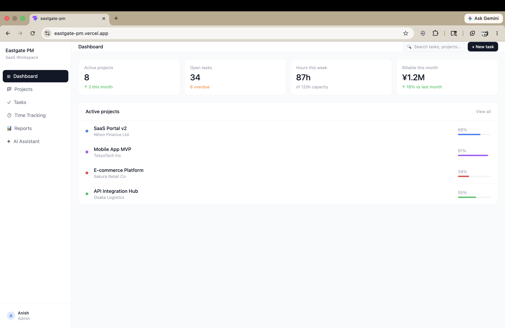

# Eastgate PM 🗂️

A full-stack, AI-powered project management platform built for SaaS development teams.



## 🔗 Live Demo
**[eastgate-pm.vercel.app](https://eastgate-pm.vercel.app)**

---

## ✨ Features

- **Dashboard** — real-time KPIs, project progress, and team activity feed
- **Kanban Board** — drag and drop task management across four stages
- **Time Tracking** — live timers with billable hour calculation in ¥
- **AI Assistant** — Claude-powered insights, risk analysis, and workload balancing
- **Projects** — filterable project table with progress tracking and budget overview
- **Client Reports** — one-click AI-generated professional client reports

---

## 🛠 Tech Stack


| Layer | Technology |
|-------|-----------|
| Frontend | React 18 + TypeScript |
| Styling | Tailwind CSS v3 |
| Build tool | Vite |
| Database | Supabase (PostgreSQL) |
| Authentication | Supabase Auth (JWT) |
| AI | Anthropic Claude API (claude-sonnet-4-5) |
| Deployment | Vercel |
| Version control | Git + GitHub |

---

## 🚀 Getting Started

### Prerequisites
- Node.js v18+
- An Anthropic API key from [console.anthropic.com](https://console.anthropic.com)

### Installation

```bash
# Clone the repository
git clone https://github.com/hsinatnias/eastgate-pm.git
cd eastgate-pm

# Install dependencies
npm install

# Set up environment variables
cp .env.example .env
# Add your Anthropic API key to .env

# Start the development server
npm run dev
```

### Environment Variables

```env
VITE_ANTHROPIC_API_KEY=your_api_key_here
```

---

## 📁 Project Structure

```
src/
├── components/
│   ├── Sidebar.tsx      # Navigation sidebar
│   ├── Header.tsx       # Top header bar
│   └── Layout.tsx       # App layout wrapper
├── pages/
│   ├── Dashboard.tsx    # KPI dashboard
│   ├── Kanban.tsx       # Drag and drop task board
│   ├── TimeTracking.tsx # Live timer and billing
│   ├── AIAssistant.tsx  # Claude API chat interface
│   ├── Projects.tsx     # Project management table
│   └── Reports.tsx      # AI report generator
├── types/
│   └── index.ts         # Shared TypeScript types
└── App.tsx              # Root component and routing
```
---

## 🧠 Key Technical Decisions

**Component architecture** — each page and UI element is a self-contained React component with its own state, making the codebase scalable and maintainable.

**TypeScript throughout** — strict typing with interfaces and union types catches errors at compile time and makes the codebase self-documenting.

**AI integration** — Claude API is called directly from the frontend with a project-aware system prompt that gives context about the team, projects, and goals.

**State management** — local React state with `useState` and `useEffect` hooks. No external state library needed at this scale.

**Functional updates** — all state updates that depend on previous state use functional updates (`prev =>`) to prevent race conditions.

---

## 🗺 Roadmap

- [x] Supabase database integration (persistent data)
- [x] User authentication (Supabase Auth + protected routes)
- [ ] Timer persistence — sync running timer seconds to database every 10 seconds
- [ ] Real-time multi-user timer sync
- [ ] PDF export for generated reports
- [ ] GitHub Actions CI/CD pipeline
- [ ] Mobile responsive layout

---

## 👨‍💻 Author

**Anish** — Full-stack developer open to opportunities in Europe and North America.

[](https://github.com/hsinatnias)

---

## 📄 License

MIT